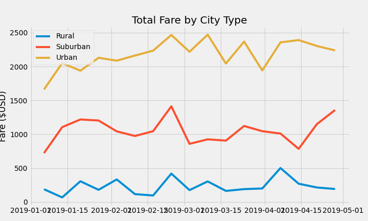

# PyBer-Analysis
Analytics Bootcamp Module 5

## Overview

This purpose of this analysis is to examine the differences in fares and drivers for PyBer in different sized municipalities. The findings of this analysis will be used to advise business strategy at PyBer.

## Results

PyBer trip data was analyzed from 120 cities for 2019. 

A summary is below:

In general, ride fares increased with decreasing city size, but overall revenue increased with city size.

Urban cities lead with respect to volume of trips; however, the rural areas tend to have more expensive trips completed. Despite the differences in fare per ride and driver, the urban centers drew more revenue overall; with total fares reaching over $39,000, versus just over $19,000 in suburban areas, and $4,000 in rural areas.

In the urban areas, there is a surplus of drivers relative to the number of rides taken. This results in a lower ratio of fares to driver than in suburban and rural areas, where there is a deficit of drivers relative to rides.

Examination of the first four months of 2019 showed a vert slight increase in ride volume in later months, most notable in urban cities:

In general, it appears that while PyBer makes more revenue from urban cities, the drivers in rural areas make more money per ride taken.

## Summary

Recommendations follow to help make the business more consistent across city size:
- Develop a strategy to keep a fair balance of drivers relative to ride demand
  - Specifically reduce the surplus of drivers in urban areas
- Optimize rates for different city types to ensure customers aren't lost due to affordability
  - this may increase ridership in rural areas
- Suburban cities may serve as a model for a balanced market